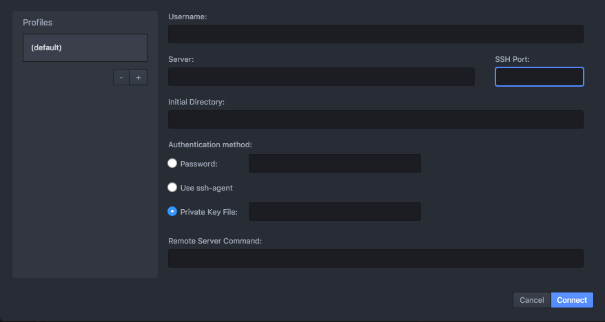
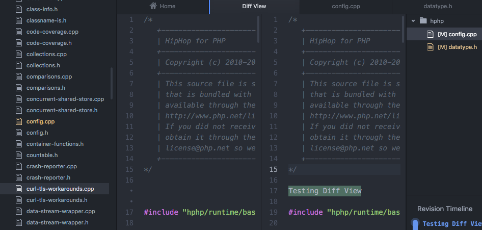

# Nuclide

Facebook 开发的一个Atom插件

安装命令

```
apm install nuclide

通过 Atom Setting 安装
```

以上安装方式都要翻墙，并且这个插件真的很大...个人使用暴力安装方式：

```
cd User/xxx/.atom/packages // 进入Atom package 目录
git clone https://github.com/facebook/nuclide.git // 你会看到漫长的等待...

// clone 成功后进入 nuclide目录下
cd nuclide/

npm install // 安装模块依赖

/*
  当然直接使用 npm install 命令也是要翻墙安装插件的，所以在使用前先把镜像源设置到阿里的 npm 镜像。
  这样不管安装什么插件，速度都不是盖的。
*/
```

## 快速打开

`cmd-t`: 快速打开历史编辑文件

- `Open File` 当前打开的文件
- `Recent File` 历史发开的文件

如果文件过多，可以在搜索框进行搜索

## 远程开发

绑定远程服务器，是的两者间的改动是同步的。

快捷打开远程服务器命令



```
ctrl-shift-cmd-C
```

还没尝试过，看着挺厉害的，等到有需要的时候看看怎么耍起来。

## Diff View

核素对Mercurial-based存储库的内置支持。如果你使用Mercurial项目,其中一个功能,可以帮助您的工作流是Diff视图。这允许您快速查看你有什么改变了文件的修改。它显示从当前承诺改变修正你跟踪。

Facebook是把Diff做到各种地方玩，这个功能找过插件，没找到合适的，个人挺喜欢这个功能的，用着看看好用不。



```
Installing nuclide dependencies

Installing haskell-grammar, language-ini, language-swift
```

官方文档：（<https://nuclide.io/docs/quick-start/getting-started/）>
