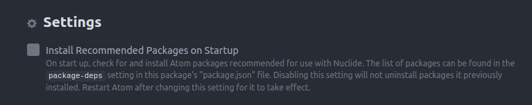
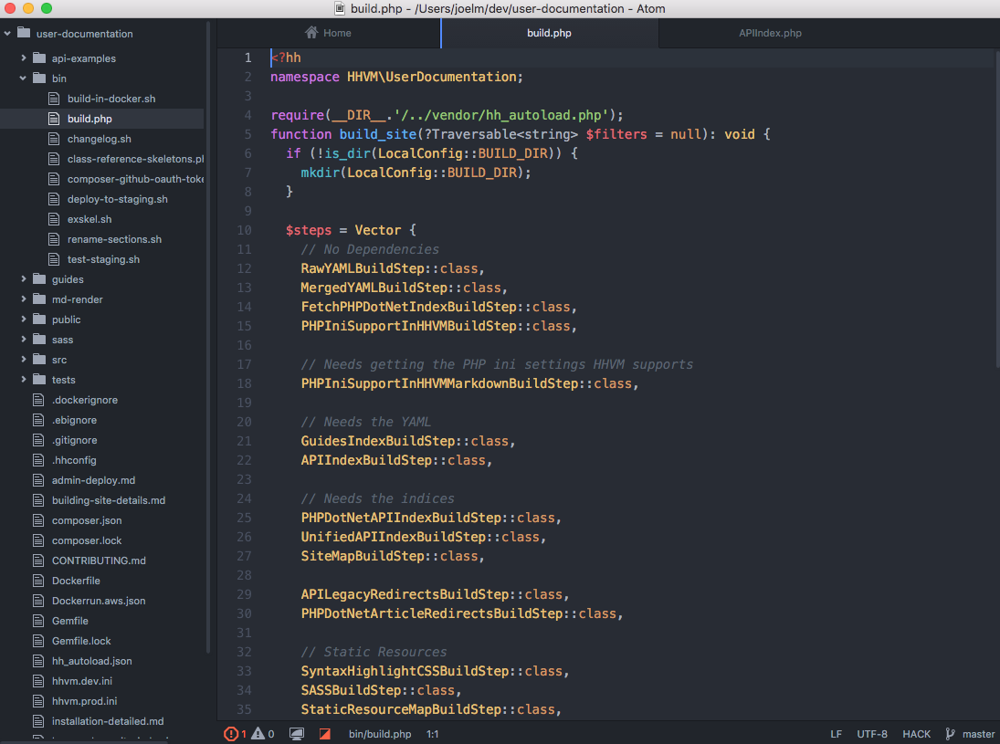

# 设置

`Nuclide` 支持的平台: Linux和Mac OS X。

## 快速安装

必须在 `Atom` 1.7.4 以上版本运行

```
$ apm install nuclide
```

## 推荐插件

- `tool-bar`: 使用 Nuclide 工具栏（一直用不起来，很奇怪）
- `sort-lines`: 文本排序工具
- `language-ocaml`: 启用OCaml语言语法高亮显示
- `language-babel`: 优化代码

可以通过在 `Nuclide` 中设置开机自动安装推荐插件



# 基础知识

`Nuclide` 是一个代码编辑器建立在GitHub的支柱的Atom文本编辑器。像其他代码编辑器和ide,`Nuclide` 的熟悉的外观和感觉。左边是你的项目树,其中包括相关的文件和文件夹。右边是主要的编辑器,该编辑器包含在您的项目的代码和文本文件。和底部状态栏提供快速浏览信息,如错误,当前文件的路径相对于你的项目根目录,打开的文件的类型,和其他环境敏感数据。



## Opening

可以直接通过终端命令打开 `Atom`

```
$ atom
```

指定文件路径可以快速打开该文件

```
$ atom /path/to/your/project/
```

默认情况下会打开 `Nuclide` 主页，但是我重来都没有出现过 `Nuclide` 主页...

## 目录

`Nuclide` 修改了默认文件树风格，可以加入了自定义添加文件快捷键

## 代码诊断

如果有安装 `language` 的包， `Nuclide` 会自动做代码诊断（一直无法使用代码诊断）

## 偏好设置

可以到 `package` 对 `Nuclide` 做个性化设置

## 文件差异对比

使用快捷键

```
cmd-shift-alt-D
```

打开差异对比视图

官方文档：（<https://nuclide.io/docs/quick-start/getting-started/）>
