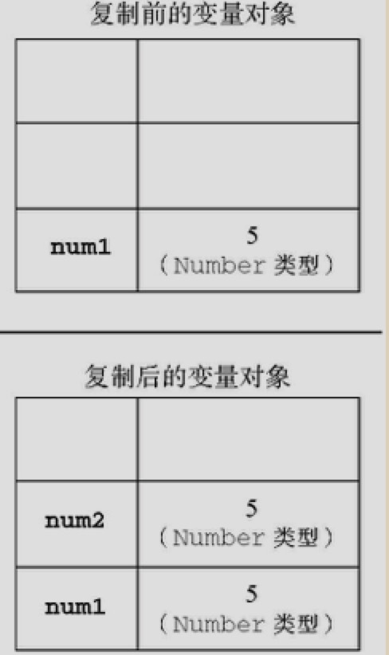
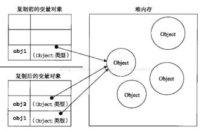

# 变量、作用域和内存问题

## 变量：

### 1、基本类型

指简单的数据段

- Undefined
- Null
- Boolean
- Number
- String

提示：不允许给基本类型添加属性（尽管这样做不会导致任何错误）：

```javascript
var name = ‘Bert’;
name.age = 27;
alert(name.age); //undefined
```

<span>
  
</span>

说明：只能给引用类型值动态地添加属性，以便将来使用。

```javascript
var num1 = 5; var num2 = num1;
```

num1中保存的值是5。当使用num1的值来初始化num2是，num2中也保存了值5.但num2中的5与num1中的5是完全独立的，该值知识num1中5的一个副本。

> 基本类型的赋值是拷贝一份副本给另一个变量，两个变量参与任何操作不会相互影响。

### 2、引用类型

指那些可能由多个值构成的对象

> 注意：引用类型的值是保存在内存中的对象。与其他语言不同，JavaScript不允许直接访问内存中的位置，也就是说不能直接操作对象的内存空间。在操作对象时，实际上是在操作对象的引用（内存地址）而不是实际的对象。为此，引用类型的值是按引用访问的。

#### 引用类型的赋值：

引用变量间的复制操作，也是将存储在变量对象中的值复制一份放到新变量中，不同的是这类值是指针（内存中的一段地址），这个指针指向存储在推中的一个对象。

复制操作结束后，两个变量实际上将引用同一个对象。因此，改变其中一个变量，就会影响另一个变量。

```javascript
var obj1 = new Object();
var obk2 = obj1;
obj1.name = "Bert";
alert(obj2.name); // bert
```



### 3、参数传递

ECMAScript中所有的函数的参数都是按值传递的。也就是说，把函数外部的值复制给函数内部的参数，就和把值从一个变量复制到另一个变量一样。

> 在向参数传递基本类型的值时，被传递的值会被复制给一个局部变量（即命名参数，或者用ECMAScript的概念来说，就是arguments对象中的一个元素）。

### 4、类型检测

#### typeof

`typeof` 操作符是确定一个变量是字符串、数值、布尔值、还是undefined的最佳工具。

> 如果变量的值是一个对象或null，则typeof操作符会像下面例子中所示的那样返回 object

```javascript
var a = "Bert";
var b = true;
var c = 22;
var d;
var e = null;
var f = new Object();

alert(typeof a); // string
alert(typeof b); // boolean
alert(typeof c); // number
alert(typeof d); // undefined
alert(typeof e); // object
alert(typeof f); // object
```

#### instanceof

检测引用类型使用 `instanceof` 操作符

> 如果变量是引用类型（根据它的原型链来识别） `instanceof` 返回 true 或 false

```javascript
alert(person instanceof Object); // 变量 person 是 Object 类型吗？
alert(colors instanceof Array); // 变量 colors 是 Array 类型吗？
alert(pattern instanceof RegExp); // 变量 pattern 是 RegExp 类型吗？
```

> 注意，匹配的对象首字母大写

### 5、执行环境
