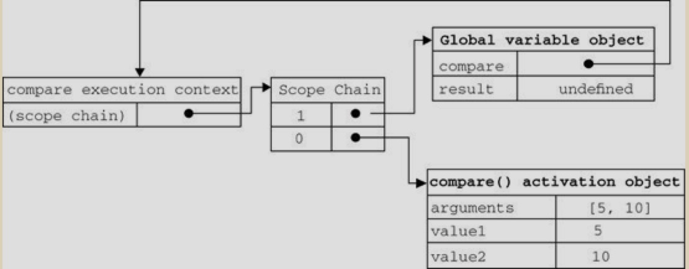
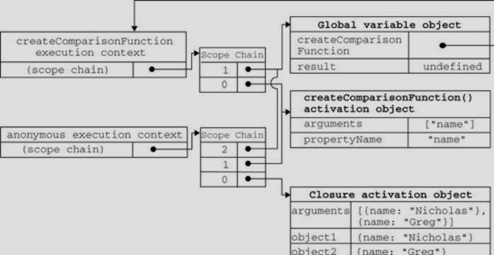

# 闭包

之前傻傻分不清 `匿名函数` 和 `闭包` 这两个概念，因此经常混用。`闭包` 是指有权访问另一个函数作用域中的变量的函数。创建闭包的常见方式，就是在一个函数内部创建另一个函数。

```javascript
function createComparisonFunction(propertyName) {
    return function(object1, object2) {
        var value1 = object1[propertyName];
        var value2 = object2[propertyName];

        if (value1 < value2) {
            return -1;
        } else if (value1 > value2) {
            return 1;
        } else {
            return 0;
        }
    }
}
```

上例 return 了一个匿名函数，该函数内部使用了 `propertyName` 变量，而这个变量是外部函数中的成员，即使这个匿名函数被返回了，且在其他地方被调用了，它仍然可以访问变量 `propertyName`。

之所以还能访问这个变量，是因为内部函数的作用域链中包含 `createComparisonFunction()` 的作用域。要彻底搞清楚其中的细节，必须从理解函数第一次被调用的时候都会发生什么入手。

当某个函数第一次被调用时，会创建一个执行环境及相应的作用域链，并把作用域链赋值给一个特殊的内部属性（Scope）。然后，使用this、arguments和其他命名参数的值来初始化函数的活动对象（activation object）。但在作用域链中，外部函数的活动对象始终处于第二位，外部函数的外部函数的活动对象处于第三位，......直至作为作用域重点的全局执行环境。

在函数执行过程中，为读取和写入变量的值，就需要在作用域链中查找变量。

```javascript
function compare(value1, value2) {
    if (value < value2) {
        return -1
    } else if (value1 > value2) {
        return 1;
    } else {
        return 0;
    }
}

var result = compare(5, 10);
```

上例代码先定义了 compare() 函数，然后又在全局作用域中调用了它。当第一次调用 compare() 时，会创建一个包含 this 、 arguments 、 value1 和 value2 的活动对象。全局执行环境的变量对象（包含 this 、 result和 compare ）在 compare() 执行环境的作用域链中则处于第二位。



看到这张图我首先是闷逼的，包括闭包这一章，我已经反复度了多变，有一天灵关一闪，想说如果是我来实现这个闭包我会怎么玩？？

先调用函数自身的作用域链，然后想寻找外围的作用域，一直到顶。

要实现这个效果挺简单的呀，弄一个数组，按顺序把他们的变量存起来，在调用的时候遍历一遍数组中的成员，看看有没有我需要的变量不就成了吗？

抱着这个想法再来看这张图，中间的那个数组不就是我想要的东西吗？因为这个函数只有一成，所以最外层的就是全局作用域了，数组0是函数本身，数组1是全局作用域。

函数指针指向的是这个数组，而这个指针同时又由全局作用域中的一个变量存储，卧槽，全通了，那么如果在函数内部在加上一个变量，是不是数组的成员就多了一位，在数组的起始位置保存该函数的作用域，这个数组就达到了我想要的效果。

于是抱着想法继续往下看...

```javascript
var compare = createComparisonFunction("name");
var result = compare({ name: "Bert"}, {name: "Greg"});
```

从 createComparisonFunction() 中被返回后，它的作用域链被初始化为包含 createComparisonFunction() 函数的活动对象和全局变量对象。这样，匿名函数就可以访问在 createComparisonFunction() 中定义的所有变量。更为重要的是 createComparisonFunction() 函数在执行完毕后，其活动对象也不会被销毁，因为匿名函数的作用域链仍然在引用这个活动对象。

当 createComparisonFunction() 函数返回后，其执行环境的作用域链会被销毁，但它的活动对象仍然会留在内存中；知道匿名函数被销毁后， createComparisonFunction() 的活动对象才会被销毁。

```javascript
var compareNames = createComparospmFimctopm("name");

// 调用函数
var result = compare({ name: "Bert"}, {name: "Greg"});

// 接触对你们函数的引用（以便释放内存）

compareNames = null;
```



看到这张图，卧槽，就是这个样，一个数组0是自建，1是父级，2是全局，如果父级多了就以此类推。

> 由于闭包会携带包含它的函数的作用域，因此会比其他函数占用更多的内存。过度使用闭包可能会导致内存占用过多，建议只在绝对必要时再考虑使用闭包。虽然像V8等优化后的JavaScript引擎会尝试回收被闭包占用的内存，但还是要慎重使用闭包
