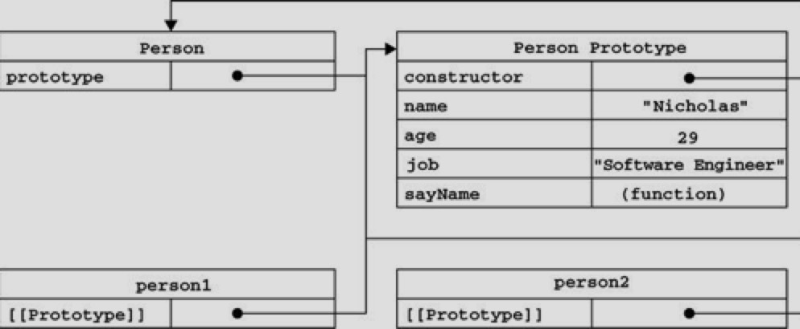

# JavaScript 创建对象

使用同一个接口创建很多对象，会产生大量的重复代码。为解决这个问题吗，人们开始使用工厂模式的一种变体。

## 工厂模式

工厂模式是软件工程领域一种广为认知的设计模式，这种模式抽象了创建具体对象的过程在。考虑到在 ECMAScript 中无法创建类，开发人员就发明了一种函数，用函数来封装以特定接口创建对象的细节。

```javascript
function createPerson(name, age, job) {
    var o = new Object();
    o.name = name;
    o.age = age;
    o.job = job;
    o.sayName = function() {
        alert(this.name);
    };

    return o;
}

var person1 = createPerson("Bert", 24, "lalala");
var person2 = createPerson("Greg", 22, "Doctor");
```

函数 createPerson() 能够根据接受的参数来构建一个包含所有必要信息的 Person 对象。可以无数次地调用这个函数，而每次它优惠返回一个包含三个属性一个方法的对象。

工厂模式虽然解决了创建多个相似对象的问题，但却没有解决对象识别问题（即怎样知道一个对象的类型）。

## 构造函数模式

ECMAScript 中的构造函数可以用来创建特定类型的对象。像 Object 和 Array 这样的原生构造函数，在运行时会自动出现在执行环境中，此外，也可以创建自定义的构建函数，从而定义自定义对象类型的属性和方法。

```javascript
function Person(name, age, job) {
        this.name = name;
        this.age = age;
        this.job = job;
        this.sayName = function() {
            alert(this.name);
        };
}

var person1 = new Person("Bert", 24, "lalala");
var person2 = new Person("Greg", 22, "Doctor");
```

上例中，Person() 函数取代了 createPerson() 函数。Person() 中的代码除了与 createPerson() 中相同的部分外，还存在以下不同之处：

- 没有显式地创建对象；
- 直接将属性和方法赋给了 this 对象；
- 没有 return 语句；

此外，还应该注意到函数名 Person 使用的是大写字母 P。按照惯例，构造函数始终都应该以一个大写字母开头，而非构造函数则应该以一个小写字母开头。这个做法借鉴自其它OO语言，主要是为了区别于 ECMAScript 中的其他函数；因为构造函数本身也是函数，只不过可以用来创建对象而已。

要创建 Person 的新实例，必须使用 new 操作符。以这种方式调用构造函数实际上会经历4个步骤：

1. 创建一个新对象；
2. 将构造函数的作用域赋给新对象（因此 this 就指向了这个新对象）；
3. 执行构造函数的代码（为这个新对象添加属性）；
4. 返回新对象；

在前面例子的最后，person1 和 person2 分别保存着 Person 的一个不同的实例。这两个对象都有一个 constructor （构造函数）属性，该属性指向 Person。

```javascript
alert(person1.constructor == Person) //true
alert(person2.constructor == Person) //true
```

对象的 constructor 属性最初是用来表示对象类型的，但是提到检测对象类型，还是 instanceof 操作符要更可靠一些：

```javascript
alert(person1 instanceof Object) //true
alert(person1 instanceof Object) //true
alert(person2 instanceof Person) //true
alert(person2 instanceof Person) //true
```

创建自定义的构造函数意味着将来可以将它的实例标识为一种特定的类型；而这正是构造函数模式胜过工厂模式的地方。

> 以这种方式定义的构造函数是定义在 Global 对象（在浏览器中是 window 对象）中的。

### 将构造函数当做函数

构造函数与其他函数的唯一区别，就在于调用它们的方式不用。不过，构造函数毕竟也是函数，不存在定义构造函数的特殊语法。任何函数，只要通过 new 操作符来调用，那它就可以作为构造函数；而任何函数，如果不通过 new 操作符来调用，那它跟普通函数也不会有什么两样。

```javascript
// 当做构造函数使用
var person1 = new Person("Bert", 24, "lalala");
person.sayName(); // Bert

// 作为普通函数调用
Person("Greg", 27, "Doctor"); // 添加到window
window.sayName(); // "Greg"

// 在另一个对象的作用域中调用
var o = new Object();
Person.call(o, "Kristen", 21, "Nurse");
window.sayName(); // "Kristen"
```

上例中前两行代码展示了构造函数的典型用法。 接下来的两行代码展示了不适用 new 操作符调用。 最后，使用Call()调用（可以使用apply()）。

### 构造

构造函数模式虽然好用，但也并非没有缺点。使用构造函数的主要问题，就是每个方法都要在每个实例上重新创建一遍。在前面的例子中，person1 和 person2 都有一个名为 sayName() 的方法，但那两个方法不是同一个 Function 的实例。（ECMAScript 中的函数式对象），因此没定义一个函数，也就是实例化了一个对象。

使用构造函数实例的对象，会导致不同的作用域链和标识符解析，但创建 Function 新实例的机制仍然是相同的。因此，不同实例上的同名函数不是相等的：

```javascript
alert(person1.sayName == person2.sayName); // false
```

创建两个完成同样任务的 Function 实例没有必要；有 this 对象在，根本不用再执行代码前就把函数半丁到特定对象上，因此，通过把函数定义转移到构造函数外部来解决这个问题：

```javascript
function Person(name, age, job) {
    this.name = name;
    this.age = age;
    this.job = job;
    this.sayName = sayName;
}

function sayName() {
    alert(this.name);
};

var person1 = new Person("Bert", 24, "lalala");
var person2 = new Person("Greg", 22, "Doctor");
```

上例中， person1 和 person2 对象就共享了在全局作用域中定义的同一个 sayName() 函数。可是新问题又来了；在全局作用域有点名不副实。而更让人无法接受的是：如果对象需要定义很多方法，那么就要定义很多个全局函数，于是我们这个自定义的引用类型就丝毫没有封装性可言了。

这些问题可言通过使用原型链模式来解决。

## 原型模式

我们创建的每个函数都有一个 prototype （原型）属性，这个属性是一个指针，指向一个对象，而这个对象的用途是包含可以由特定类型的所有实例共享的属性和方法。如果按照字面意思来理解，那么 prototype 就是通过调用构造函数而创建的那个对象实例的原型对象。使用原型对象的好处是可以让所有对象实例共享它所包含的属性和方法。换句话说，不必在构造函数中定义对象实例的信息，而是可以将这些信息直接添加到原型对象中。

```javascript
function Person() {}

Person.prototype.name = "Bert";
Person.prototype.age = "20";
Person.prototype.job = "Software Engineer";
Person.prototype.sayName = function() {
    alert(this.name);
}

var person1 = new Person();
person1.sayName(); // "Bert"

var person2 = new Person();
person2.sayName(); //Bert

alert(person1.sayName == person2.sayName); // true
```

我们将sayName() 方法和所有属性直接添加到了 Person 的 prototype 属性中，构造函数变成了空函数。即使如此，也仍然可以通过调用构造函数来创建新对象，而且新对象还会具有相同的属性和方法。但与构造函数模式不同的是，新对象的这些属性和方法是由所有实例共享的。换句话说，person1 和 person2 访问的都是同一组属性和同一个 sayName() 函数。

### 理解原型对象

无论什么时候，只要创建了一个新函数，就会根据一组特定的规则为该函数创建一个 prototype 属性，这个属性指向函数的原型对象。在默认情况下，所有的原型对象都会自动获得一个 contructor （构造函数）属性，这个属性包含一个指向 prototype 属性所在函数的指针。

拿前面例子来说，Person.prototype.constructor 指向 person。而通过这个构造函数，我们还可以继续为原型对象添加其他属性和方法。

创建了自定义的构造函数之后，其原型对象默认只会取得 constructor 属性；至于其他方法，则都是从Object继承来的。当调用构造函数创建一个新实例后，该实例的内部将会包含一个指针（内部属性），指向构造函数的原型对象。ECMA-262 第五版中把这个指针叫 [[prototype]] 。虽然在脚本中没有标准的方式访问 [[prototype]]，但Firefox、Safari和Chrome在每个对象上都支持一个属性 `__proti__`；而在其他的实现中，这个属性对脚本则是完全不可见的。不过，要明确的真正重要的一点就是，这个链接存在于实例与构造函数的原型对象之间，而不是存在于实例与构造函数之间。



上图展示了 Person 构造函数、Person的原型属性以及 Person 现有的两个实例之间的关系。

Person.prototype 指向了原型对象，而 Person.prototype.constructor 又指回了 Person。原型对象中除了包含 contructor 属性之外，还包括后来添加的其他属性。

Person的每个实例 ---- person1 和 person2 都包含一个内部属性，该属性仅仅指向了 Person.prototype；换句话说，它们与构造函数没有直接的关系。此外，要格外注意的是，虽然这两个实例都不包含属性和方法，但我们却可以调用 person1.sayName() 。 这是通过查找对象属性的过程来实现的。

虽然在所有实现中都无法访问到 [[Prototype]]，但可以通过 isPrototypeOf() 方法来确定对象之间是否存在这种关系。从本质上讲，如果 [[Prototype]] 指向调用 isPrototype() 方法的对象(Person.prototype)，那么这个方法就返回 true：

```javascript
alert(Person.prototype.isPrototypeOf(person1)); //true;
alert(Person.prototype.isPrototypeOf(person2)); //true;
```

这里，我们用原型对象的 isPrototypeOf() 方法测试了 person1 和 person2。因为它们内部都有一个指向 Person.prototype 的指针，因此都返回了 true。

> 注释：所以 isPrototypeOf()方法内部是做了判断，person1.prototype === Person? 如果对象的原型与 Person 相等，那么就可以证明是 Person 的实例

ECMAScript 5 增加了一个新方法，叫 Object.getPrototypeOf()，在所有支持的实现中，这个方法返回 [[Prototype]] 的值：

```javascript
alert(Object.getPrototypeOf(person1) == Person.prototype); // true
alert(Object.getPrototypeOf(person1).name); // Bert
```

这里的第一行代码只是确定 Object.getPrototypeOf() 返回的对象实际就是这个对象的原型。第二行代码取得了原型对象中 name 属性的值，也就是 "Bert"。使用 Object.getPrototypeOf() 可以方便地取得一个对象的原型，而这在利用原型实现继承的情况下是非常重要的。

支持这个方法的浏览器有 IE9+、Firefox 3.5+、Safari 5+、Opera 12+ 和 chrome。

每当代码读取某个对象的某个属性时，都会执行一次搜索，目标是具有给定名字属性。搜索首先从对象实例本身开始。如果在实例中找到了具有给定名字的属性，则返回该属性的值；如果没有找到，则继续搜索指针指向的原型对象，在原型对象中查找具有给定名字的属性。如果在原型对象中找到了这个属性，则返回该属性。

也就是说，在我们调用 person1.sayName() 的时候，会先后执行两次搜索。首先，解析器会问："实例 person1 有 sayName 属性吗？"回答："没有。"然后，它继续搜索，再问："person1 的原型有 sayName属性吗？"回答："有。"于是，他就读取那个保存在原型对象中的函数。当我们调用 person2.sayName() 时，将会重现相同的搜索过程，得到相同的结果。而这整是多个对象实例共享原型所保存的属性和方法的基本原理。

> 原型最初只包含 constructor 属性，该属性也是共享的，因此可以通过对象实例访问 。

虽然可以通过对象实例访问保存在原型中的值，但却不能通过对象实例重写原型中的值。如果我们在实例中添加了一个属性，而该属性与实例原型中的一个属性同名，那我们就在实例中创建该属性，该属性将会屏蔽原型中的那个属性。

```javascript
function Person() {}

Person.prototype.name = "Bert";
Person.prototype.age = "20";
Person.prototype.job = "Software Engineer";
Person.prototype.sayName = function() {
    alert(this.name);
}

var person1 = new Person();
var person2 = new Person();

person1.name = "Greg";

alert(person1.name); // Greg —— 来自实例
alert(person2.name); // Bert —— 来自原型
```

上例中，person1 的 name 被一个新值给屏蔽了。但无论访问 person1.name 还是访问 person2.name 都能够正常的返回值，即分别是 "Greg"（来自对象实例）和 "Bert" （来自原型）。

当为对象实例添加一个属性时，这个属性就会屏蔽原型对象中保存的同名属性；换句话说，添加这个属性只会阻止我们访问原型中的那个属性，但不会修改那个属性。即使将这个属性设置为 null，也只会在实例中设置实例的属性，而不会恢复其指向原型的属性。不过，使用 delete 操作符则可以完全删除实例属性，从而让我们能够重新访问原型中的属性。

```javascript
function Person() {}

Person.prototype.name = "Bert";
Person.prototype.age = "20";
Person.prototype.job = "Software Engineer";
Person.prototype.sayName = function() {
    alert(this.name);
}

var person1 = new Person();
var person2 = new Person();

person1.name = "Greg";

alert(person1.name); // Greg —— 来自实例
alert(person2.name); // Bert —— 来自原型

person1.name = null;
alert(person1.name); // null

delete person1.name;
alert(person1.name); // Bert —— 来自原型
```

在这个修改后的例子中，将 person1.name 赋值为 null，后访问结果显示 "null"，使用 delete 操作符删除了 person1.name，之前它保存的是实例的值。把它删除以后，就恢复了对原型中name属性的链接。因此接下来调用 person1.name 时，返回的就是原型中 name 属性的值了。

使用 hasOwnProperty() 方法可以监测一个属性是存在于实例中，还是存在于原型中。这个方法（从 Object 继承）只在给定属性存在于对象实例中时，才会返回 true。

```javascript
function Person() {}

Person.prototype.name = "Bert";
Person.prototype.age = "20";
Person.prototype.job = "Software Engineer";
Person.prototype.sayName = function() {
    alert(this.name);
}

var person1 = new Person();
var person2 = new Person();

alert(person1.hasOwnProperty("name")); // false


person1.name = "Greg";
alert(person1.name); // Greg —— 来自实例
alert(person1.hasOwnProperty("name")); // true

alert(person2.name); // Bert —— 来自原型
alert(person2.hasOwnProperty("name")); // false

person1.name = null;
alert(person1.name); // null
alert(person1.hasOwnProperty("name")); //true

delete person1.name;
alert(person1.name); // Bert —— 来自原型
alert(person1.hasOwnProperty("name")); // false
```

通过使用 hasOwnProperty() 方法，什么时候访问的是实例属性，什么时候访问的是原型属性就一清二楚了。调用 person1.hasOwnProperty("name")时，知有当 person1 重写 name 属性后才会返回 true，因为只有这个时候 name 才是一个实例属性，而非原型属性。

> ECMAScript 5 的 Object.getOwnPropertyDescriptor() 方法只能用于实例属性，要取得原型属性的描述符，必须直接在原型对象上调用 Object.getOwnPropertyDescriptor() 方法

### 原型与 in 操作符

有两种方式使用 in 操作符：单独使用和在 for-in 循环中使用。在单独使用时，in 操作符会在通用对象能够访问给定属性时返回 true，无论该属性存在于实例中还是原型中。

```javascript
function Person() {}

Person.prototype.name = "Bert";
Person.prototype.age = "20";
Person.prototype.job = "Software Engineer";
Person.prototype.sayName = function() {
    alert(this.name);
}

var person1 = new Person();
var person2 = new Person();

alert(person1.hasOwnProperty("name")); //false
alert("name" in person1); // true

person1.name = "Greg";
alert(person1.name); // Greg —— 来自实例
alert(person1.hasOwnProperty("name")) // ture
alert("name" in person1) // true


alert(person2.name); // Bert —— 来自原型
alert(person2.hasOwnProperty("name")); //false
alert("name" in person2); // true

delete person1.name;
alert(person1.name); // Bert —— 来自原型
alert(person1.hasOwnProperty("name")); //false
alert("name" in person1); // true
```

上例代码执行的整个过程，name 属性要么是直接在对象上访问到的，要么是通过原型访问到的。因此，调用 "name" in person1 始终都返回true，无论该属性存在于实例中还是存在于原型中。同时使用 hasOwnProperty() 方法和 in 操作符，就可以确定该属性到底是存在于对象中，还是存在于原型中。

```javascript
function hasPrototypeProperty(object, name) {
    return !Object.hasOwnProperty(name) && (name in object);
}
```

由于 in 操作符只要通过对象能够访问到属性就返回 true， hasOwnProperty() 返回 fasle，就可以确定属性是原型中的属性。

在使用 for-in 循环时，返回的是所有能够通过对象访问的、可枚举的（enumerated）属性，其中既包括存在于实例中的属性，也包括存在于原型中的属性。屏蔽了原型中不可枚举的属性（即将[[Enumerable]]标记的属性）的实例属性也会在 for-in 循环中返回，因为根据规定，所有开发人员定义的属性都是可枚举的 ---- 只有在IE8及更早版本中例外。

IE早期版本的实现中存在一个bug，即屏蔽不可枚举属性的实例属性不会出现在 for-in 循环中。

```javascript
var o = {
    toString: function() {
        return "My Object";
    }
}

for (var prop in o) {
    if(prop == "toString") {
        alert("Found toString") // 在IE中不显示
    }
}
```

当上例代码运行时，应该会显示一个警告框，表明找到了 toString() 方法。这里的对象 o 定义了一个名为 toString() 的方法，该方法屏蔽了原型中（不可枚举）的 toSting() 方法。在IE中，由于其实现认为原型的 toSting() 方法被打上了 [[Enumerable]] 标记就应该跳过该属性，结果我们就不会看到警告框。该Bug会影响默认不可枚举的所有属性和方法，包括：hasOwnProperty()、toString()和ValueOf()。

要取得对象上所有可枚举的实例属性，可以使用 ECMAScript 5 的 Object.keys() 方法，这个方法接受一个对象作为参数，返回一个包含所有可枚举属性的字符串数组。

```javascript
function Person() {};

Person.prototype.name = "Bert";
Person.prototype.age = "20";
Person.prototype.job = "Software Engineer";
Person.prototype.sayName = function() {
    alert(this.name);
}

var keys = Object.keys(Person.prototype);
alert(keys); // name,age,job,sayName

var p1 = new Person();
p1.name = "Rob";
p1.age = 31;
var p1keys = Object.keys(p1);
alert(p1keys); // name,age
```

这里，变量 keys 中将保持一个数组，数组中是字符串 name、age、job和sayName。这个顺序也是它们在 for-in 循环中出现的顺序。如果是通过 Person 的实例调用，则 Object.keys() 返回的数组只包含 name 和 age。

如果想要得到所有属性，无论它是否枚举，都可以使用 Object.getOwnPropertyNames() 方法。

```javascript
var keys = Object.getOwnPropertyNames(Person.prototype);
alert(keys); // constructor,name,age,job,sayName
```

### 更简单的原型语法

从视觉上更好的封装原型功能，做法是用一个包含所有属性和方法的对象字面量来重写整个原型对象。

```javascript
function Person() {}

Person.prototype = {
    name: "Bert",
    age: "20",
    job: "Software Engineer",
    sayName: function() {
        alert(this.name);
    }
}
```

上例为 Person.prototype 设置为等于一个以对象字面量形式创建的新对象。

> 这样做会使得 constructor 属性不再指向 Person 了。

每创建一个函数，就会同时创建它的 prototype 对象，这个对象也会自动获取得 constructor 属性。而我们在这里使用的语法，本质上完全重写了默认的 prototype 对象，因此 constructor 属性（指向 Object 构造函数），不在指向 Person 函数。

尽管 instanceof 操作符还能返回正确的结果，但通过 constructor 已经无法确定对象的类型了。

```javascript
var friend = new Person();

alert(friend instanceof Object); // true
alert(friend instanceof Person); // true
alert(friend.constructor == Object); // true
alert(friend.constructor == Person); // false
```

用 instanceof 操作符测试 Object 和Person 仍然返回 true，但 constuctor 属性则等于 Object 而不等于 Person 了。如果 constructor 的值很重要，可以特意将 constructor 设置回适当值。

```javascript
function Person() {}

Person.prototype = {
    constructor: Person,
    name: "Bert",
    age: "20",
    job: "Software Engineer",
    sayName: function() {
        alert(this.name);
    }
}
```

上例代码特意包含了一个 constructor 属性，并将它的值设置为 Person，从而确保了通过该属性能够访问到适当的值。

> 注意：以这种方式重设 constructor 属性会导致它的 [[Enumerable]] 特性被设置为 true。默认情况下，原生的 constructor 属性是不可枚举的，因此如果你使用兼容 ECMAScript 5 的 JavaScript 引擎，可以试试 Object.defineProperty()。

```javascript
function Person() {}

Person.prototype = {
    name: "Bert",
    age: "20",
    job: "Software Engineer",
    sayName: function() {
        alert(this.name);
    }
}

// 重设构造函数，只适用于 ECMAAScript 5 兼容的浏览器
Object.defineProperty(Person.prototype, "constructor", {
    enumerable: false,
    value: Person
})
```

### 原型的动态性

由于在原型中查找值的过程是一次搜索，因此我们队原型对象所做的任何修改都能够立即从实例上反映出来 ---- 即使是先创建了实例后修改原型也是一样。

```javascript
var friend = new Person();
Person.prototype.sayHi = function() {
    alert("Hi");
}

friend.sayHi(); // Hi
```

尽管可以随时为原型添加属性和方法，并且修改能够立即在所有对象实例中反映出来，但如果是重写整个原型对象，那么情况就不一样了。

调用构造函数时会为实例添加一个指向最初原型的 [[prototype]] 指针，而把原型修改为另一个对象就等于切断了构造函数与最初原型之间的联系。

> prototype 是指向原型的地址，而修改 prototype 的值就是将其指向一个新的地址。

> 注意：实例中指针仅指向原型，而不指向构造函数。

```javascript
function Person() {}

var friend = new Person();

Person.prototype = {
    name: "Bert",
    age: "20",
    job: "Software Engineer",
    sayName: function() {
        alert(this.name);
    }
}

friend.sayName(); // error
```

### 原生对象的原型

原型模式的重要性不仅体现在创建自定义类型方面，就连所有原生的引用类型，都是采用这种模式创建的。所有原生引用类型（Object、String、Array等）都在其构造函数的原型上定义了方法。

在 Array.prototype 中可以找到 sort() 方法，而在 String.prototype 中可以找到 substring() 方法。

```javascript
alert(typeof Array.prototype.sort);  // function
alert(typeof String .prototype.substring);  // function
```

### 原型对象的问题

原型模式也不是没有确定，它省略了为构造函数传递初始化参数，结果所有实例在默认情况下都将取得相同的属性。

原型中所有属性都被很多实例共享，这种共享对于引用类型的对象的使用就存在较大的问题。

```javascript
function Person() {}

Person.prototype = {
    constructor: Person,
    name: "Bert",
    age: "20",
    job: "Software Engineer",
    friends: ["Shelby", "Court"],
    sayName: function() {
        alert(this.name);
    }
}

var person1 = new Person();
var person2 = new Person();

person1.friends.push("Van");

alert(person1.friends); // Shelby,Court,Van
alert(person2.friends); // Shelby,Court,Van
alert(person1.friends === person2.friends); // true
```

Person.prototype 对象由一个名为 friends 的属性，该属性包含一个字符串数组。然后，创建了 Person 的两个实例。

此时，修改了 person1.friends 引用的数组，因为 friends 是在原型上共享的属性，导致 person2.friends 的值也跟着改变。

正式这个原因所以很少有人单独使用原型模式。

### 组合使用构造函数模式和原型模式

创建自定义类型的最常见方式，就是组合使用构造函数与原型模式，构造函数模式用于定义实例属性，而原型模式用于定义方法和共享的属性。

> 构造 + 原型 结合使用非常牛逼，每个实例可以初始化自己的属性，且又有共享的属性，最大限度地节省了内存。

```javascript
function Person(name, age, job) {
    this.name = name;
    this.age = age;
    this.job = job;
    this.friends = ["shelby", "Court"];
}

Person.prototype = {
    constructor: Person,
    sayName: function() {
        alert(this.name);
    }
}

var person1 = new Person("Nicholas", 29, "Software Engineer");
var person2 = new Person("Greg", 27, "Doctor");
person1.friends.push("Van");
alert(person1.friends); // shelby,Court,Van
alert(person2.friends); // shelby,Court
alert(person1.sayName === person2.sayName); // true
alert(person1.friends === person2.friends); // false
```

这种构造函数与原型混成的模式，是目前在 ECMAScript 中使用最广泛、认同度最高的一种创建自定义类型的方法。可以说这是用来定义引用类型的一种默认模式。

### 动态原型模式

把所有信息都封装在构造函数中，而通过在构造函数中初始化原型（仅在必要的情况下），又保存了同时使用构造函数和原型的优点。

> 通过检查某个应用存在的方法是否有效，来决定是否需要初始化原型。

```javascript
function Person(name, age, job) {
    // 属性
    this.name = name;
    this.age = age;
    this.job = job;

    if (typeof this.sayName != "function") {
        Person.prototype.sayName = function() {
            alert(this.name);
        }
    }
}

var friends = new Person("Bert", 24, "Software Engineer");
friends.sayName();
```

注意：这里只在 sayName() 方法不存在的情况下，才会将它添加到原型中。这段代码只会在初次调用构造函数时才会将它添加到原型中。不过，这里对原型所做的修改，能够立即在所有实例中得到反映。

> 使用动态原型模式时，不能使用对象字面量重写原型。如果在已经创建了实例的情况下，重写原型，那么就会切断现有实例与新原型之间的联系。

### 寄生构造函数模式

这种模式的基本思想是创建一个函数，该函数的作用仅仅是封装创建对象的代码，然后再返回新创建的对象；但从表面上看，这个函数又很想是典型的构造函数。

```javascript
function Person(name, age, job) {
    var o = new Object();
    o.name = name;
    o.age = age;
    o.job = job;
    o.sayName = function() {
        alert(this.name);
    }
    return o;
}

var friend = new Person("Bert", 24, "Software Engineer");
friend.sayName(); // Bert
```

除了使用 new 操作符并把使用的包装函数叫做构造函数之外，这个模式跟工厂模式其实是一模一样的。假设想穿件一个具有额外方法的特殊数组。由于不能直接修改 Array 构造函数，因此可以使用这个模式。

```javascript
function SpecialArray() {
    // 创建数组
    var values = new Array();

    // 添加值
    values.push.apply(values, arguments);

    // 添加方法
    values.toPipedString = function() {
        return this.join("|");
    }

    // 返回数组
    return values;
}

var colors = new SpecialArray("red", "blue", "green");
alert(colors.toPipedString()); // red|blue|green
```

关于寄生构造函数模式，有一点需要注意：首先，返回的对象与构造函数或者与构造函数的原型属性之间没有关系；也就是说，构造函数返回的对象与在构造函数外部创建的对象没有什么不同。不能依赖 instanceof 操作符来确定对象类型。由于存在上述问题，建议在可以使用其他模式的情况下，不要使用这种模式。

### 稳妥构造函数模式

稳妥对象指的是没有公共属性，而且其他方法也不引用 this 的对象。稳妥对象最适合在一些安全的环境中（这些环境中会禁止使用 this 和 new），或者在防止数据被其他应用程序（如Mashup程序）改动时使用。

稳妥构造函数遵循与寄生构造函数类似的模式，但有两点不同：一是新创建对象的实例方法不引用 this； 二十不使用 new 操作符调用构造函数。

```javascript
function Person(name, age, job) {
    var o = new Object();
    name = name;
    age = age;
    job = job;

    o.sayName = function() {
        alert(name);
    }
    return o;
}
```

这样，变量 person 中保存的是一个稳妥对象，而除非调用 sayName() 方法外，没有别的方式可以访问其数据成员。即使有其他代码会给这个对象添加方法或数据成功，但也不可能有别的办法访问掺入到构造函数中的原始数据。

> 备注：把函数内部的值私有化，对外暴露访问方式，提升函数内部属性的安全性。与寄生构造函数模式类似，这种模式用 instanceof 操作符对这种对象没有意义。
