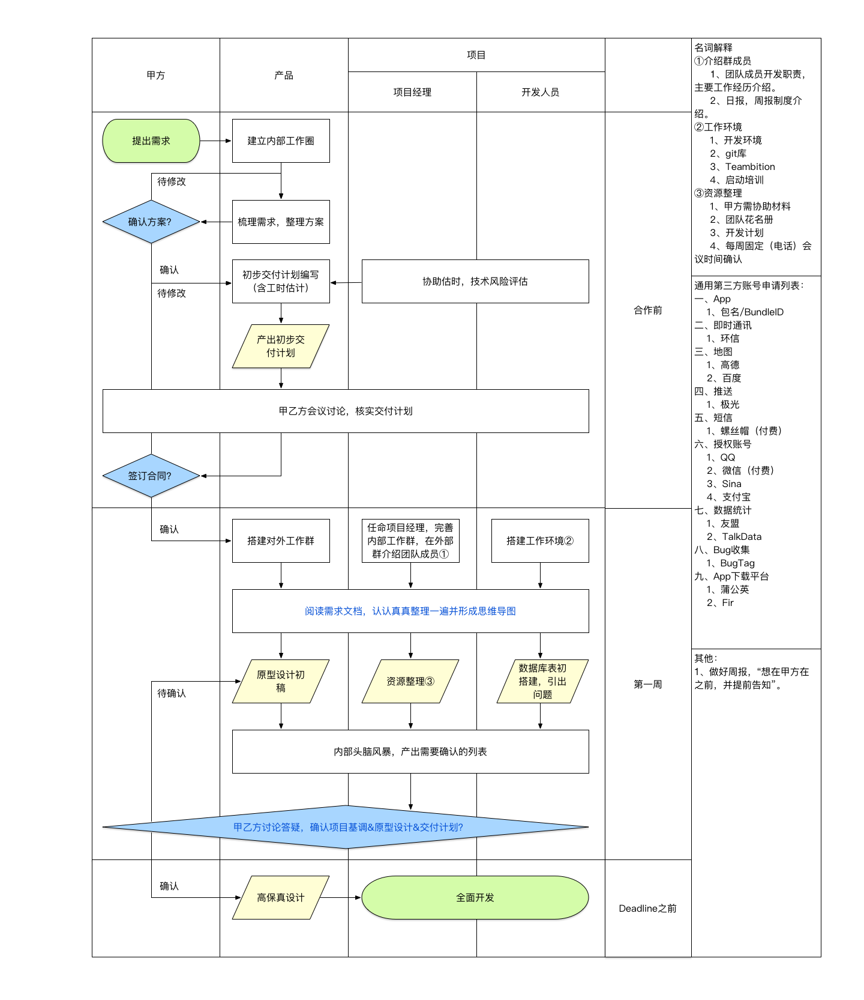

# 项目管理初期准备：

## 内部流程图



## 准备工作

### 一、创建内部交流圈

1.微信工作圈。

### 二、任务管理：

1.TB创建项目

- 用于跟新任务。

1.PMS创建项目

- 用于记录任务工时、日报、周报（目标替换掉TB）。

2.Case创建项目

- 用于记录整个项目的生命周期，与相关资源。

### 三、日报格式：

```
书香学府日报（2016.12.09）
一、客户端
Android：

iOS：

HTML开发：

二、服务端
后台：


接口：

三、设计
1、原型设计：

2、高保真设计：
```

### 四、周报格式：

书香学府周报

类别      | 详情
:------ | :------
IOS     | xxx，进行中
Android | xxx，已完成
后台      | xxx
接口      | xxx

```
粮达网周报（2016年12月第二周）
上周总结：

前端：
1、xxx
    1.1、xxxx。
    1.2、xxxx。

后端：

服务：

接口开发

优化以及bug修复

测试：


本周计划：
前端：
1、xxx
    1.1、xxxx。
    1.2、xxxx。

后端：

服务：
```

```
新催费系统 （2016.12.10 ~ 2016.12.16 周计划）

目标：
1、xxx
2、xxx

资源梳理：
1、【xxx】
    1.1、xxx。
    1.2、xxx。

整体计划：
1、xxx
2、xxx：
    2.1、xxxx。
    2.2、xxxx。

周一工作：
1、xxx。
2、xxx。
```

```
ICE本周初步计划（会根据实际情况补充调整）1210：
1、xx管理系统
      1.1、xxx。
      1.2、xxx。

2、xxx
     iOS：

    android：

3、xxx

4、case2.0

5、AG&ICE管理后台


上周总结：
一、彩生活
1、case2.0

2、新彩管家
     IOS：

     android:

3、其他服务

4、新资源管理系统
```

### 五、人员列表

失控人员列表

姓名  | 英文名      | 职责    | 联系电话 | 邮箱
:-- | :------- | ----- | ---- | -------------
张三啊 | zhangsan | 首席忽悠师 | 110  | nihao@110.com

其他团队人员列表

姓名  | 英文名      | 职责    | 联系电话 | 邮箱
:-- | :------- | ----- | ---- | -------------
张三啊 | zhangsan | 首席忽悠师 | 110  | nihao@110.com

### 六、项目章程

```
项目章程：

1.公司名称：超人公司
2.项目开始时间：2016年8月29日  
  预计完成时间：2016年11月30日
3.项目预算：45万人民币
4.项目目标：建立超人公司web平台＋移动平台（H5)
5.主要功能模块：超人服务、超人管理、超人变身、超人进化
```

### 七、沟通计划

```
沟通计划：

1.每日发送工作汇总  
2.每周通过邮件发送项目进展
3.每周见面沟通项目进展（每周周五下午三点）
日工作汇总：＊月＊日：1.完成＃＃工作任务；2.需要注意的问题；3.遇到的困难
周工作汇报：＊月＊日：1.周项目进展；2.项目延期情况（并有解决措施） 3.周项目计划
```

### 八、记录

月份   | 相关人员                     | 记录事项
:--- | :----------------------- | --------------
9月7日 | 团队1：张三、李四、王五； 团队2： 赵六、孙七 | 1、功能反馈；2原型设计讨论

记录类型：

1. 任务反馈。
2. 原型设计
3. 细节讨论
4. UI设计评审
5. 流程图设计评审
6. 功能设计评审
7. 成果评审

  - H5
  - APP

### 九、计划变更记录

版本   | 变更项    | 操作人
:--- | :----- | ---
V1.0 | 某某功能升级 | 张三

### 十、项目计划

序号  | 工作项  | 里程碑/交付物                                  | 子任务        | 负责人 | 执行人     | 预计完成时间   | 实际完成时间   | 状态      | 备注
:-- | :--- | ---------------------------------------- | ---------- | --- | ------- | -------- | -------- | ------- | -----
001 | 需求分析 | 1、初版功能导图；2、修订版功能导图；3、初版功能说明书；4、功能需求说明书V1 | 1.1、初版功能导图 | xxx | xxx，xxx | 2016.9.9 | 2016.9.9 | 已完成（绿色） | xxx 2 | 产品设计 | 1、xxx | 1.1、xxx | xxx | xxx，xxx | 2016.9.9 | 2016.9.9 | 进行中（灰色） | xxx 3 | 高保真 | 1、xxx | 1.1、xxx | xxx | xxx，xxx | 2016.9.9 | 2016.9.9 | 进行中（灰色） | xxx | 里程碑1 | 第一版交付物 | 交付功能 | xxx | xxx，xxx | 2016.9.9 | 2016.9.9 | 已完成（绿色） | xxx 4 | 开发 | 1、xxx | 1.1、xxx | xxx | xxx，xxx | 2016.9.9 | 2016.9.9 | 进行中（灰色） | xxx 5 | 测试 | 1、xxx | 1.1、xxx | xxx | xxx，xxx | 2016.9.9 | 2016.9.9 | 进行中（灰色） | xxx 6 | Bug修复 | 1、xxx | 1.1、xxx | xxx | xxx，xxx | 2016.9.9 | 2016.9.9 | 进行中（灰色） | xxx

#### 1.进度

| 进度
| :--
| 25%

#### 2.状态颜色区分

状态      | 颜色
:------ | :---
未开始     | 指定颜色
进行中     | 指定颜色
暂停/遇到问题 | 指定颜色
已完成     | 指定颜色

#### 3、工作项 -> 里程碑/交付物 -> 子任务

1. 需求分析

  - 初版功能导图

    - 初版功能导图

  - 修订版功能导图

    - 修订版功能导图分析

  - 初版功能说明书

    - 功能说明书

  - 功能说明书V1.0

    - 功能说明书主架构
    - 各个模板功能描述
    - 细化功能需求说明书
    - 具体功能和操作

2. 产品设计

  - 原型设计

    - 【Web端】首页
    - 【Web端】某某模块
    - 【APP】
    - 【H5】

  - 修订版原型设计

    - 【Web端】
    - 【APP】
    - 【H5】

3. 高保真

  - 高保真设计

    - 【Web】
    - 【APP】
    - 【H5】

4. 开发

  - 【Web】某某模块

    - UI设计
    - 某某功能Demo（调研类统一说辞）
    - 某某功能开发
    - 某某功能数据打通
    - 某某功能

  - 【服务端】

    - 某某接口
    - 某某库表设计

5. 测试

  - 某某模块

    - 某某功能测试
    - 某某接口测试

6. Bug修复

  - 某某模块

    - 某某功能修复

### 十二、功能列表

Web前端

一级模块 | 二级模块          | 内容     | 负责人 | 执行人 | 优先级
:--- | :------------ | ------ | --- | --- | ---
默默模块 | 1.某某功能 2.某某功能 | 某某功能描述 | 负责人 | 执行人 | 高

Web后台

一级模块 | 二级模块          | 内容     | 负责人 | 执行人 | 优先级
:--- | :------------ | ------ | --- | --- | ---
默默模块 | 1.某某功能 2.某某功能 | 某某功能描述 | 负责人 | 执行人 | 高

App - H5页面

一级模块 | 二级模块          | 内容     | 负责人 | 执行人 | 优先级
:--- | :------------ | ------ | --- | --- | ---
默默模块 | 1.某某功能 2.某某功能 | 某某功能描述 | 负责人 | 执行人 | 高

### 十三、风险控制计划

风险类型   | 评价项目      | 风险等级                                                | 评分 | 影响占比
:----- | :-------- | --------------------------------------------------- | -- | ----
需求了解   | 对客户管理需求了解 | 1、详细掌握；2、基本掌握；3、大概了解；4、了解一点；5、不清楚                   | 1  | 6%
产品功能匹配 | 标准产品不能满足  | 1、完全匹配；2、已有基本匹配插件；3、已有部分现成开发插件；4、大量二次开发任务；5、完全开发新需求 | 1  | 3%
客户需求   | 客户业务定行    | 1、明确；2、基本明确；3、模棱两可；4、模糊；5、不明确                       | 1  | 6%

#### 1.风险类型 -> 评价项目

1. 需求了解

  - 对某某需求了解
  - 对某某需求引导
  - 对客户预期目标的掌握
  - 对客户需求的挖掘

2. 产品功能匹配

  - 标准产品与客户需求匹配程度
  - 标准产品不能满足
  - 异构系统集成度

3. 双边沟通

  - 【高层】与【客户】建立沟通渠道和机制
  - 【公司机构负责人】与【客户高层】建立沟通渠道和机制
  - 【项目组】与【客户高层】建立沟通渠道和机制
  - 【项目组】与【客户中层】建立沟通渠道和机制
  - 【项目组】与【核心用户】奖励沟通渠道和机制

4. 客户业务特点

  - 客户业务领域
  - 客户业务定型

5. 客户需求

  - 客户业务领域
  - 客户业务定型

6. 个性化开发

  - 需求是否明确
  - 工作量
  - 开发周期

7. 项目配合

  - 客户高层是否参与项目
  - 公司是否提供充分资源
  - 客户项目组成员配合情况
  - 核心用户配合情况

8. 解决方案

  - 解决方案与客户所处行业匹配度
  - 解决方案与客户企业匹配度

9. 行业限制

  - 行业准入
  - 行业法律法规

#### 2.风险等级

1. 完全掌控
2. 基本掌控
3. 一半一半
4. 基本失控
5. 完全失控

#### 3.风险计算

所有风险项的风险等级的平均值

#### 4.影响占比

所有风险项的影响占比的总和
