# 新收费系统功能整理

## 房屋

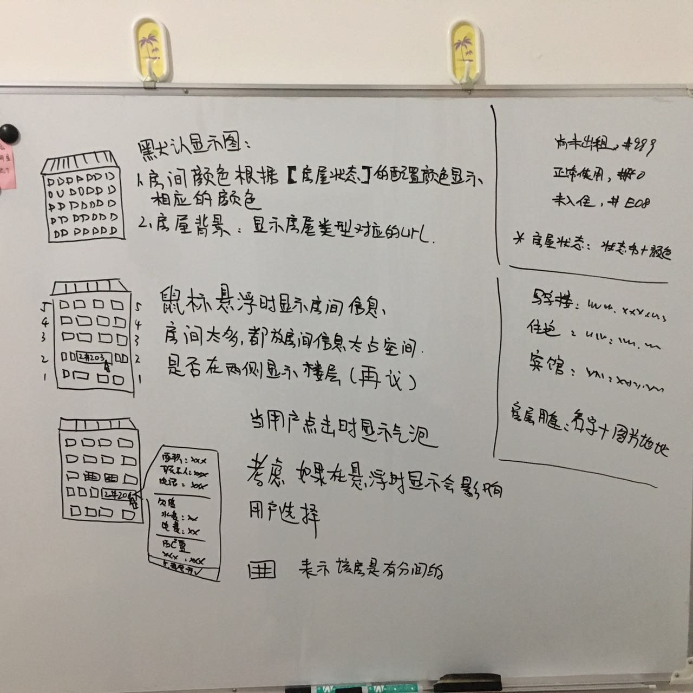

### 主要元素：

房态主要用于收费员、或者小区管理者,思考一个收费员、小区管理者关心的是什么？？

> 关系人：收费员、抄表员、业主

1. 【收费员】我们看的小区有几幢房屋，每间房屋有没有需要收费的？噢，看到要收费的了，通知缴费。

2. 【收费员】房屋的状态是否正常，每间房间现在都是做什么用的？如果业主要将房屋出租如何设置房屋状态？

3. 【收费员】房屋的计费规则都配置好了嘛？如果要更换房间的规则要怎么操作？

4. 【收费员】房屋的计费规则都配置好了嘛？检查下是否是有异常情况，通知配置员配置或者自行处理。

5. 【收费员】如何知道哪件房间已经缴费了？有新的交费信息进来是否要在房态图上显示？

6. 【收费员、业主】业主要过来缴费，怎么样快速定位到某件房间，通过搜索（房间号、业主姓名）？？

7. 【收费员、业主】业主要过来说发现费用异常，怎么样快速定位到某件房间，并且能够快速找到该房间的计费相关信息？？

8. 【收费员、抄表员】收费员和抄表员在房态页面上会有直接关系吗？？还没想到

#### 房屋用途
- 名字+图片地址：写字楼、住宅、宾馆、机房、居委会...
- 页面上作为楼栋的背景体现

#### 房屋状态

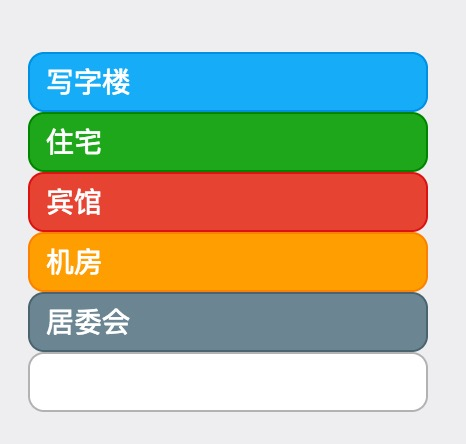

- 名字+颜色：尚未出租、正常使用、未入住、暂时闲置、长期闲置...
- 页面上需要有专门位置体现
- 用于对比房间颜色

### 楼栋：

#### 基本展示效果

- 以房屋类型的图片作为背景
- 房间按楼层顺序排列（1楼在最下面、2楼在一楼上面以此类推）
- 房间背景已状态设置的颜色值作为背景
- 默认不显示房间信息

#### 鼠标悬浮到房间时

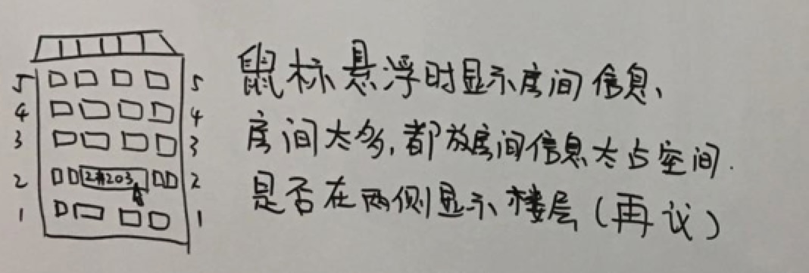

- 鼠标悬浮到房间上时
    - 悬浮的房间拉长显示出房间信息
    - 两侧的房间宽度减小保持整体长度不变
    - 如图：悬浮到【2单元203】对应的房间显示出【2单元203】，其他房间宽度变小

- 考虑：房间都显示出来占位置，而且楼层信息不同，显示出来的房间效果会有位置上的问题。

- 是否在两侧显示楼栋数（再议）。

#### 鼠标点击房间时

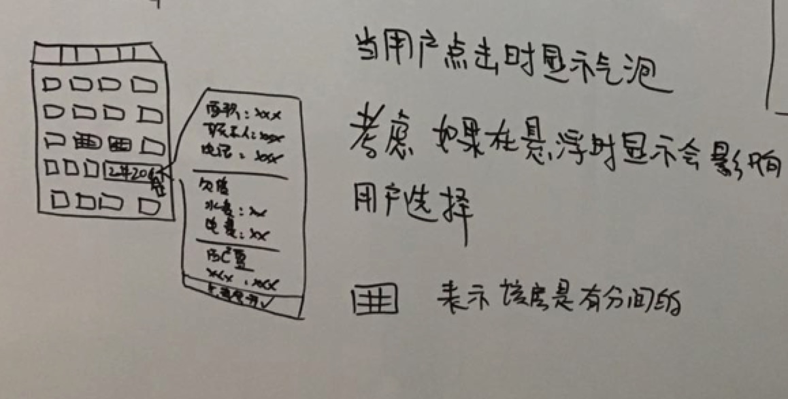

- 鼠标点击房间时弹出气泡，显示房间信息：

    - 房屋基本信息：建筑面积、收费面积、客户名称、联系人、联系电话
    - 房间欠费信息：正常欠费、超期欠费、部分欠费、总欠费
    - 房间配置是否有配置

如果信息多可以考虑隐藏部分。甚至可考虑隐藏部分是动态加载的数据。

#### 分间：

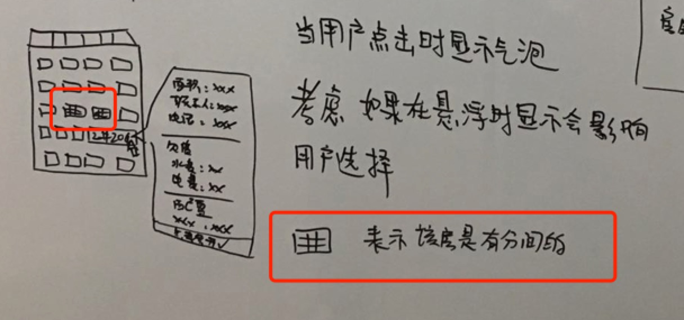

- 每间房间有一个是否分间的状态
- 通过判断房屋的分间状态展示不同的效果

## 房屋详情

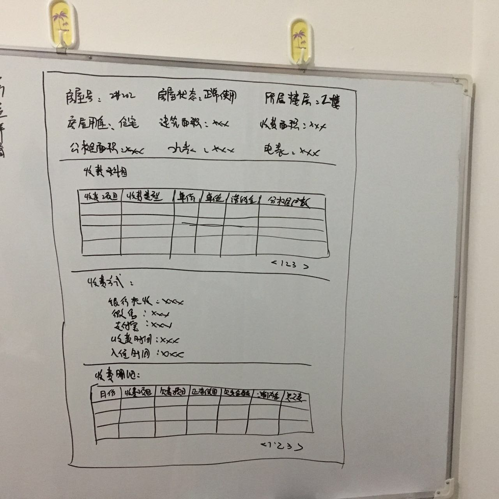

> 郭玲的原型图上想表示的应该是Tab布局，个人建议可以使用流式布局更加现代化。

### 详情信息

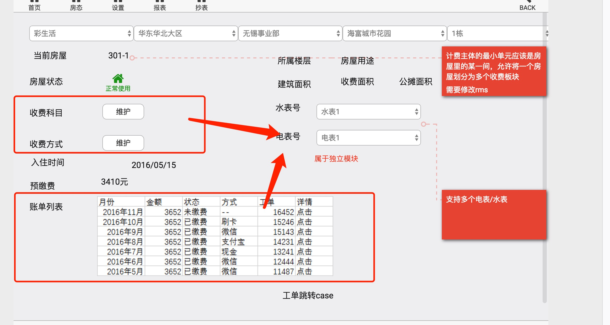

- 当前房屋号、所属楼层、房屋用途、房屋状态、建筑面积、收费面积、公摊面积、水表、电表、入住时间

### 收费科目

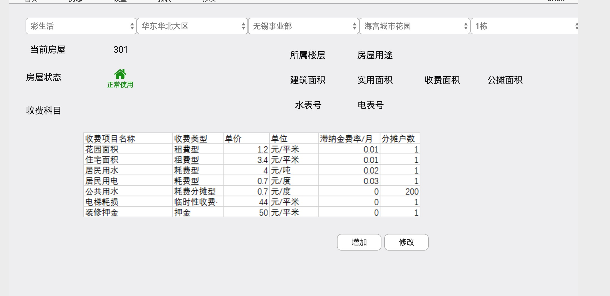

- 收费科目列表字段：收费项目名称、收费类型、单价、单位、滞纳金费率/月、分摊户数
- 收费科目有两种情况：
    - 增加收费项，从收费项列表中选择收费项进行添加
    - 删除收费项，删除列表中的某条收费项

彩生活收费项示意图：

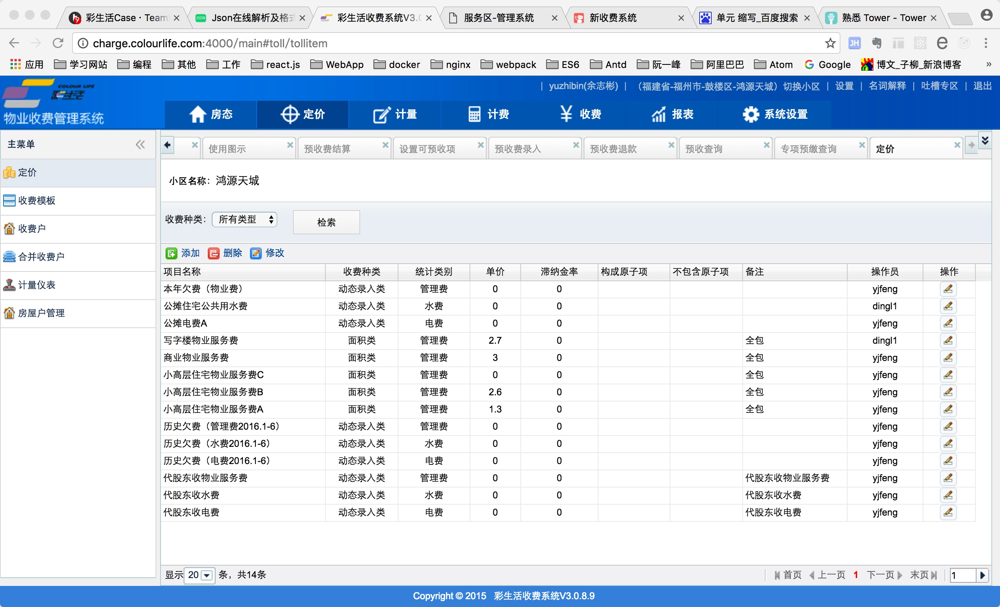

### 收费设置（收费方式）

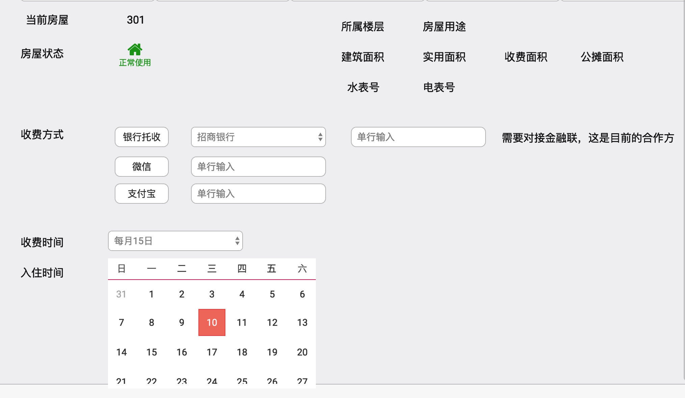

- 只知道填写完是要做事情的，做什么事不知道，需要继续询问。

### 收费详情

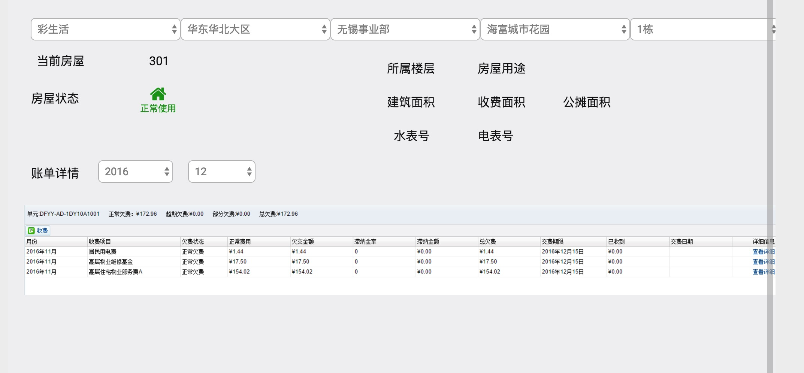

- 收费详情列表字段：月份、收费项目、欠费状态、正常使用、欠交金额、滞纳金额、总欠费、缴费期限、已收到、缴费日期
- 账单统计信息：单元、正常欠费数、超期欠费、部分欠费、总欠费
